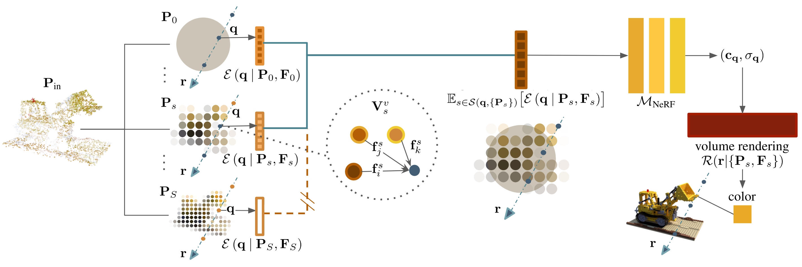

#  PointNeRF++: A multi-scale, point-based Neural Radiance Field (ECCV 2024).

<!--  -->

> :warning: Upon request, we provide the code for reproduction. I will also clean up and refactor it in the near future to improve readability when I have some free time.

## Introduction
This is the official repository for the PyTorch implementation of "PointNeRF++: A multi-scale, point-based Neural Radiance Field" by [Weiwei Sun](https://wsunid.github.io/), [Eduard Trulls](https://etrulls.github.io/), [Yang-Che Tseng](https://scholar.google.com/citations?user=1iJfq7YAAAAJ&hl=en),  [Sneha Sambandam](https://scholar.google.com/citations?user=QDwM53oAAAAJ&hl=en), [Gopal Sharma](https://hippogriff.github.io/), [Andrea Tagliasacchi](https://taiya.github.io/), [Kwang Moo Yi](https://www.cs.ubc.ca/~kmyi).

## Download links  
[Project Sites](https://pointnerfpp.github.io/)
|[Paper](https://pointnerfpp.github.io/resources/paper.pdf) 
|[ArXiv](https://arxiv.org/abs/2312.02362) 

## Reference
Please cite our paper if you use this source core or data in your research (in any shape or format). 
```
@inproceedings{sun2025pointnerf++,
  title={Pointnerf++: A multi-scale, point-based neural radiance field},
  author={Sun, Weiwei and Trulls, Eduard and Tseng, Yang-Che and Sambandam, Sneha and Sharma, Gopal and Tagliasacchi, Andrea and Yi, Kwang Moo},
  booktitle={European Conference on Computer Vision},
  pages={221--238},
  year={2025},
  organization={Springer}
}
```


## Installation 
We provide [environment.yml]() for environment installation. Note it helps if you start from the enviroment of [PointNeRF](https://github.com/Xharlie/pointnerf).  

### Datasets.
Please follow [PointNeRF](https://github.com/Xharlie/pointnerf) to prepare the `ScanNet` and `NeRF Synthetic`. 


## Training/testing scripts 

### NeRF Synthetic 
<details>
  <summary>train/test script (e.g., Chair)</summary> 

```
bash dev_scripts/colmap_pcd/chair_plane_globalnerf_prop.sh nerfsyn/prop_half identity mvs 1.6 learned 3 chair 0 grid_sampling 0.004 pts_planes 2 constant_ones -2 1 train triplane
```
</details>

### ScanNet 
<details>
  <summary>train/test script (e.g., scene0101_04)</summary> 

```
bash dev_scripts/incomplete_pcd/scannet_planes_globalnerf_prop.sh scannet/propnet identity mvs 2.0 learned 3 scene0101_04 0 grid_sampling 0.008 pts_planes 2 constant_ones -2 1 train triplane
```
</details>


## Acknowledgement
For fair comparison, our repo is heavily based on [PointNeRF](https://github.com/Xharlie/pointnerf). So please also consider them if you use this source. 

This work was supported in part by the Natural Sciences and Engineering Research Council of Canada (NSERC) Discovery Grant, NSERC Collaborative Research and Development Grant, Google, Digital Research Alliance of Canada, and Advanced Research Computing at the University of British Columbia.

## LICENSE
We base our license on [PointNeRF](https://github.com/Xharlie/pointnerf), which is restricted to academic use only. See [LICENSE](https://github.com/Xharlie/pointnerf/blob/master/LICENSE.md). 
